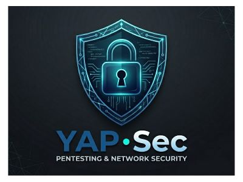

<h1 align="center">
  <br>
  
  <br>
  YaP-Sec
  <br>
</h1>

<h4 align="center">An automated, full-stack cybersecurity orchestration and dashboard framework.</h4>

<p align="center">
  <a href="#features">Features</a> •
  <a href="#installation">Installation</a> •
  <a href="#usage">Usage</a> •
  <a href="#architecture">Architecture</a>
</p>

---

## Overview

**YaP-Sec** (Yet Another Pentesting Security stack) is a comprehensive, cross-platform cybersecurity orchestration tool. It unifies industry-standard pentesting and auditing tools under a modern web dashboard and provides a native GUI launcher that completely automates system dependency installation and environment setup.

Forget the days of manually hunting down dependencies or managing disparate CLI outputs. YaP-Sec seamlessly integrates tools like **Nmap, Metasploit, SQLmap, Nuclei, Lynis**, and more into a single interactive Vite + React interface powered by a high-speed FastAPI backend.

## Features

- **Automated Stack Setup:** One-click dependency installation utilizing native Polkit (`pkexec`) prompts for seamless sudo escalation. 
- **Cross-Platform:** Automatically detects and interfaces with major Linux package managers (`apt`, `dnf`, `pacman`).
- **Interactive Dashboard:** Beautiful, responsive React frontend.
- **Unified Tool Execution:** Run your favorite tools from a single control center.
- **Built-in Kill Switch:** Instantly halt all running security processes via the dashboard or API.
- **Dynamic Port Management:** Automatically falls back to open ports if defaults are occupied.
- **Self-Healing Virtual Environments:** Automatically rebuilds corrupted or moved Python `.venv` directories.

### Integrated Tools
* **Pentesting:** Nmap, Metasploit, SQLmap, Nuclei, Aircrack-ng suite
* **Auditing:** Lynis, OpenSCAP, Checkov
* **System Utilities:** Docker, Git, Python

## Installation

Getting started is designed to be frictionless. Ensure you have `bash` and a working internet connection.

```bash
# Clone the repository
git clone https://github.com/yourusername/YaP-Sec.git

# Navigate into the project
cd YaP-Sec
```

## Usage

YaP-Sec ships with a native GUI launcher that manages the entire lifecycle of the application—from installing missing dependencies to spinning up the local servers.

To start the launcher, simply run:
```bash
./launch_gui.sh
```

### The Launcher Interface

1. **Auto Setup:** If this is your first time cloning the repo, click this button. It will securely prompt you for your password via a native GUI dialog, install any missing system packages, construct the Python virtual environment, download the NPM packages, and instantly launch the app.
2. **Run & Open Dashboard:** Use this for your daily workflow. It skips the deep dependency checks and starts the FastAPI backend and Vite frontend synchronously in less than a second.
3. **Stop Server:** Immediately kills the servers and any orphaned background security scans.

## Architecture

- **Frontend:** Built with Vite, React, and TypeScript.
- **Backend:** Built with Python and FastAPI. Integrates bridge modules (`backend/modules/*`) that securely interface with system-level security binaries.
- **Orchestration:** Python and Bash scripts seamlessly orchestrate package managers across Debian, Fedora, and Arch Linux architectures.

---

<p align="center">
  <i>Developed for Security Researchers and Penetration Testers.</i>
</p>
